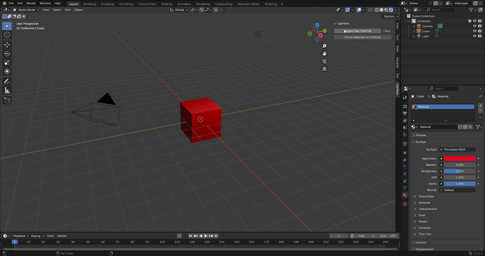

<h1 align="center">
    Lightbox
</h1>
<p align="center">
    Blender study add-on for various utility functions
</p>

<p align="center">
    <a href="https://github.com/kutaycoskuner/project_lightbox/issues">Bug Report / Feature Request</a> 
</p>

<p align="center">
    
    
    
    
    
</p>

<p align="center">
    
        <br>
    <sub><i> Eevee Clay material override</i></sub>
</p>

# Features

-   [x] **EEVEE Clay Material Override**  
        Overrides all materials within the scene with a basic clay material. Toggles back to the original materials on button click.  
        **Access**
        &nbsp;
        Interface
        &ensp;&nbsp;
        `View3D > Lightbox > Toggle Clay`  

-   [x] **Focus Selected on Outliner**  
        Focuses selected object on View3D on outliner on complex scenes.  
        **Access**
        &nbsp;
        Interface
        &ensp;&nbsp;
        `View3D > Lightbox > Focus Outliner`   
        &emsp;&emsp;&emsp;&ensp; Keyboard
        &ensp;
        `SHIFT + ALT + W`

-   [x] **Origin to Ground**  
        Setting object center to ground to provide better control in game engines.  
        **Access**
        &nbsp;
        Interface
        &ensp;&nbsp;
        `View3D > Lightbox > Origin to Ground`   
        &emsp;&emsp;&emsp;&ensp; Keyboard
        &ensp;
        `SHIFT + ALT + C`

-   [x] **Origin to Geometry**  
        Setting object center to geometry center to provide better control for modelling.  
        **Access**
        &nbsp;
        Interface
        &ensp;&nbsp;
        `View3 > Lightbox > Origin to Geometry`   
        &emsp;&emsp;&emsp;&ensp; Keyboard
        &ensp;
        `SHIFT + ALT + S`

# Pre-Release Installation

1.  Download lightbox folder from this repository.
2.  Use a compression tool like 7-Zip to create .zip file from the folder
3.  Open Blender version.
4.  In the top bar, open the Edit menu.
5.  Select Preferences window.
6.  On the left side of the Preferences window, choose the Add-ons tab.
7.  In the top right of the Preferences window, click down arrow, then click the Install button.
8.  Browse to the Lightbox .zip file you downloaded.
9.  In the bottom right of the file browser, click Install Add-on.
10. You should now see Lightbox in the list of add-ons.
11. Tick the box to the left of the add-on name to enable it.
12. On your 3D Viewport press N to open context menus.
13. You should be able to see Lightbox UI on right of your editor.

# Architecture
```plaintext
lightbox/
├── __init__.py                     # main entry point       
├── core/                           # core functionality
│   ├── __init__.py
|   └── ...
├── operators/                      # individual operations
|   ├── op_operation1.py
|   ├── op_operation2.py
|   └── ...
├── panels/                         # UI panels
│   ├── main_panel.py
│   └── subpanels/                  # optional sub-panels
├── config/                         # property definitions
│   ├── __init__.py
│   └── prefs.py                    # preferences
└── utils/                          # shared utilities
    ├── __init__.py
    └── helpers.py
```

# Work in Progress

# Roadmap
**Feature: Project Organization Helper**
A directory and naming convention guide and automation tools for setting up a robust project environment.

**Feature: Simple Rig Generator for Cycle Animations**
A rig builder similar to mixamo rigs. Simplicity on implementing inverse kinematics, copy rotation, location and pole targets with separated base / control rig interfaces.

**Feature: Shader Editor Node Previews**  
A small preview frames on top of each node on shader editor for better comprehension and control of node-based procedural texture creation.

**Feature: Renderqueue**  
 A renderqueue function with an interface that allows you to set multiple camera, resolution, keyframe renders in batch.

# References
1. This project is conducted by using various addons such as [GScatter](https://gscatter.com/gscatter) and [bakernode](https://github.com/avelgest/baker-node)

2. [Blender Python API](https://docs.blender.org/api/current/index.html)


<!-- [Return to top]() -->
